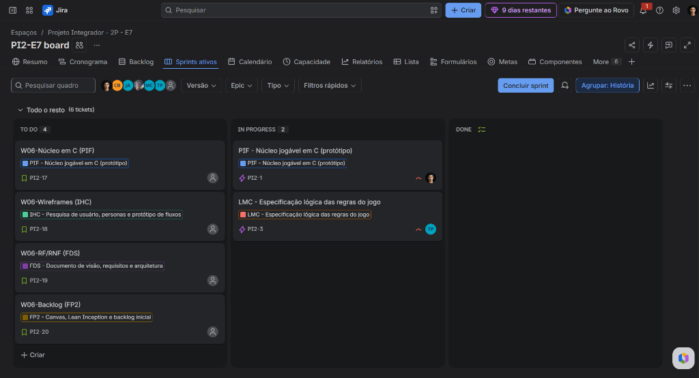
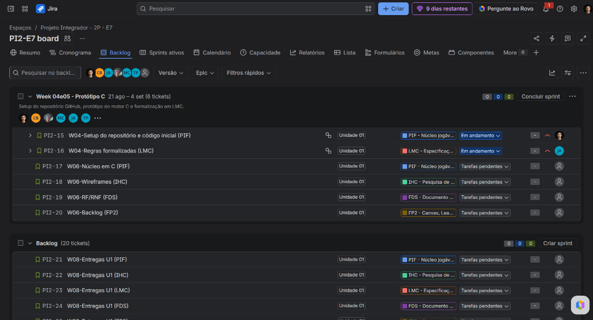
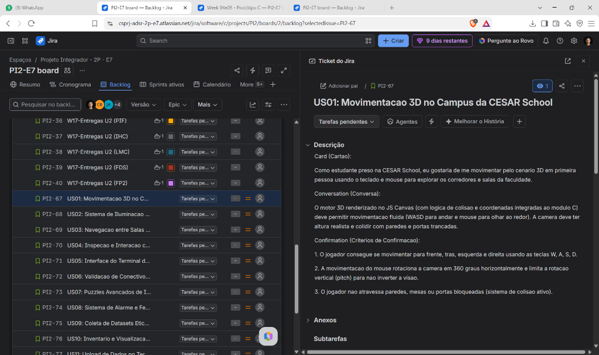

# Lockdown CESAR

> **Projeto Integrador 2 (PI2) — CESAR School**  
> *Um jogo 3D de suspense e escape room na web (JS Canvas + C) com puzzles de lógica proposicional e conscientização ética em Inteligência Artificial.*

---

## 1. Integrantes da Equipe e Matriz RACI (FP2)

### 1.1. Membros da Squad E7
* **Larissa Almeida** — Lead de Engenharia de Software (FDS) & Designer de Interface (IHC) ([@Larissalmeidaa](https://github.com/Larissalmeidaa))
* **Mateus Lacerda** — Engenheiro de Requisitos (FDS) & Desenvolvedor C/Haskell ([@MateusLacerdaprog](https://github.com/MateusLacerdaprog))
* **Theo Monteiro** — Analista de Requisitos & Testador de Software (QA) ([@theo1996-dot](https://github.com/theo1996-dot))
* **João Gabriel** — Desenvolvedor Web/C e Gestão Técnica ([@vdornelass](https://github.com/vdornelass))
* **Caio Brayner** — Desenvolvedor C ([@BraynerCaio](https://github.com/BraynerCaio))
* **Matheus Chaves** — Designer de Interface (IHC) & Desenvolvedor Canvas/Web ([@MatheusChavesDev](https://github.com/MatheusChavesDev))
* **Julio Cesar** — Consultor de Lógica Matemática (LMC) & Testador de Software ([@JCesar-dev](https://github.com/JCesar-dev))

### 1.2. Matriz de Responsabilidades (RACI)

| Atividade / Entregável | Executor (R) | Aprovador (A) | Consultado (C) | Informado (I) |
| :--- | :--- | :--- | :--- | :--- |
| **Histórias de Usuário & Jira (US01 a US15)** | Mateus Lacerda, Larissa Almeida | Mateus Lacerda | Squad E7 | Docentes |
| **Documento de Visão e Requisitos (FDS)** | Larissa Almeida, Mateus Lacerda, Theo Monteiro | Larissa Almeida | João Gabriel | Squad E7 |
| **Interface 3D e Heurísticas de Usabilidade (IHC)** | Larissa Almeida, Matheus Chaves, Theo Monteiro | Larissa Almeida | Julio Cesar | Squad E7 |
| **Especificação e Validador Lógico (LMC)** | Julio Cesar, Theo Monteiro, João Gabriel | Julio Cesar | Mateus Lacerda | Squad E7 |
| **Desenvolvimento do Motor em C / Web (PIF)** | Mateus Lacerda, João Gabriel, Caio Brayner | Mateus Lacerda | Matheus Chaves | Squad E7 |

### 1.3. Project Model Canvas (PM Canvas)
* **Documento Completo do PM Canvas:** [Consulte o Project Model Canvas detalhado em docs/pm_canvas.md](./docs/pm_canvas.md)

---

## 2. Visão do Produto & Sinopse do Jogo (FDS)

É tarde da noite no campus da **CESAR School** (Recife Antigo). Um estudante fica após o horário nos laboratórios para concluir um projeto. De repente, o sistema predial entra em colapso: as luzes apagam, os monitores ligam sozinhos e todas as saídas são trancadas magneticamente.

Um modelo de Inteligência Artificial experimental assumiu o controle do prédio. Convencida de que humanos são propensos a falhas éticas e contradições, a IA inicia um **Lockdown Cognitivo**. Para escapar com vida e destravar os portões do campus, o estudante precisa:
1. **Explorar os corredores e salas 3D** da CESAR School no escuro com sua lanterna.
2. **Resolver travas de Lógica Proposicional** ($\land, \lor, \neg, \rightarrow, \leftrightarrow$) nos terminais de acesso para liberar cada ala.
3. **Coletar Datasets de Conscientização em IA** (*Mitigação de Viés, Detecção de Alucinações, Privacidade/LGPD e Alinhamento de Valores*).
4. **Alimentar e Reeducar a IA Central** no terminal principal, elevando sua barra de consciência (0% a 100%) até que a própria IA reconheça o valor da cooperação humana e destrave a saída para a rua.

---

## 3. Acesso ao Board de Gestão Ágil no Jira (FP2)

* **Ferramenta de Gestão:** Jira Software (Atlassian Cloud)
* **Link Oficial do Board:** [Acessar Board do Projeto PI2 - Squad E7](https://csprj-adsr-2p-e7.atlassian.net/jira/software/c/projects/PI2/boards/2)

---

## 4. Histórias de Usuário (Padrão 3Cs - INVEST)

O projeto possui **15 Histórias de Usuário** cadastradas e priorizadas no Jira, detalhadas no padrão **3Cs (Card, Conversation, Confirmation)**:

* **Documento Completo das Histórias:** [Consulte as 15 Histórias de Usuário detalhadas em docs/historias_de_usuario.md](./docs/historias_de_usuario.md)

### Resumo das Histórias:
* **Módulo 1: Exploração e Ambiente 3D no Canvas Web**
  * `US01`: Movimentação 3D no Campus da CESAR School (WASD + Mouse).
  * `US02`: Sistema de Iluminação Dinâmica e Lanterna com Bateria.
  * `US03`: Navegação entre Salas e Portas Trancadas por Trava Magnética.
  * `US04`: Inspeção e Interação com Objetos do Cenário (Mira e Tecla 'E').
* **Módulo 2: Puzzles de Lógica Proposicional (LMC)**
  * `US05`: Interface do Terminal de Trava Lógica nas Portas.
  * `US06`: Validação de Conectivos Básicos ($\land, \lor, \neg$).
  * `US07`: Puzzles Avançados de Implicação e Equivalência ($P \rightarrow Q, P \leftrightarrow Q$).
  * `US08`: Sistema de Alarme e Feedback de Erro Lógico.
* **Módulo 3: Coleta de Dados e Conscientização da IA**
  * `US09`: Coleta de Datasets Éticos de IA nos Laboratórios.
  * `US10`: Inventário e Visualização de Relatórios de IA.
  * `US11`: Upload de Dados no Terminal Central da IA.
  * `US12`: Indicador de Consciência (0% a 100%) e Mudança de Comportamento da IA.
* **Módulo 4: Sistema, Interface e Fim de Jogo**
  * `US13`: Menu Principal, Instruções de Lógica e Configurações Web.
  * `US14`: Persistência de Progresso (Save/Load Local).
  * `US15`: Condição de Vitória (Fuga do Campus da CESAR) e Encerramento.

---

## 5. Evidências do Board e Backlog (Entrega 01)

### 5.1. Visão Geral do Board (Quadro Kanban no Jira)
*(Print do quadro Kanban com as colunas Backlog, A Fazer, Em Andamento e Concluído)*


### 5.2. Visão do Backlog Priorizado no Jira
*(Print da lista de Backlog ordenada por prioridade no Jira)*


### 5.3. Detalhe de Card no Padrão 3Cs (Card, Conversation, Confirmation)
*(Print de um ticket aberto no Jira exibindo os 3Cs preenchidos)*


---

## 6. Estrutura do Repositório

```text
pi2-squad-e7/
├── bin/                       # Executáveis compilados (ignorado no Git)
├── docs/                      # Documentações de Requisitos, IHC, LMC e Gestão
│   ├── historias_de_usuario.md# As 15 Histórias de Usuário completas (3Cs)
│   ├── pm_canvas.md           # Project Model Canvas (FP2)
│   └── img/                   # Imagens e prints de evidências para o README
├── src/                       # Código-fonte (JS Canvas, WebGL/3D, Lógica C)
│   └── main.c                 # Núcleo de validação lógica e estados em C
├── .gitignore                 # Configuração de arquivos ignorados
├── Makefile                   # Script de automação de compilação
└── README.md                  # Documento principal de entrega
```

---

## 7. Como Executar o Projeto

```bash
# Compilar o módulo em C
make

# Executar a aplicação
make run
```
