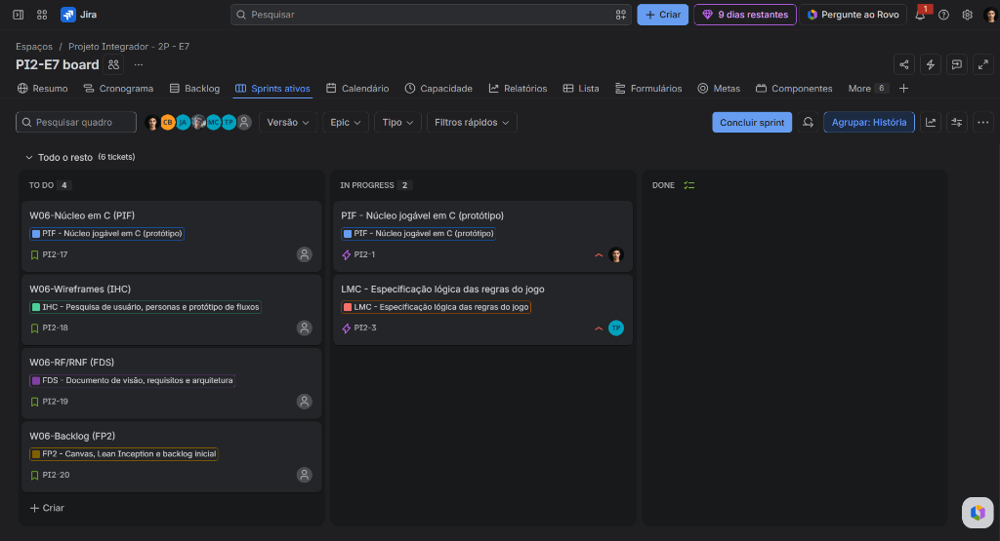
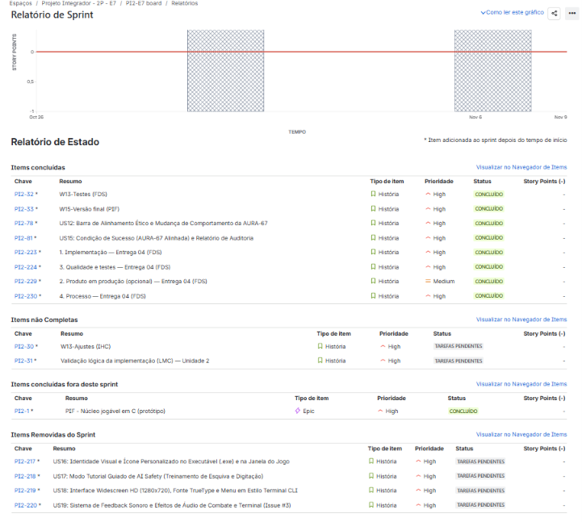
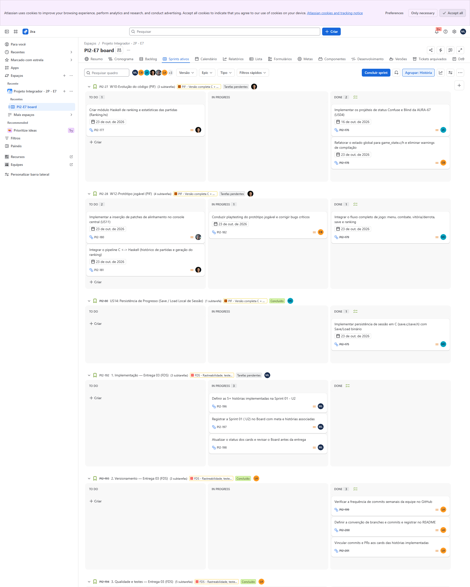
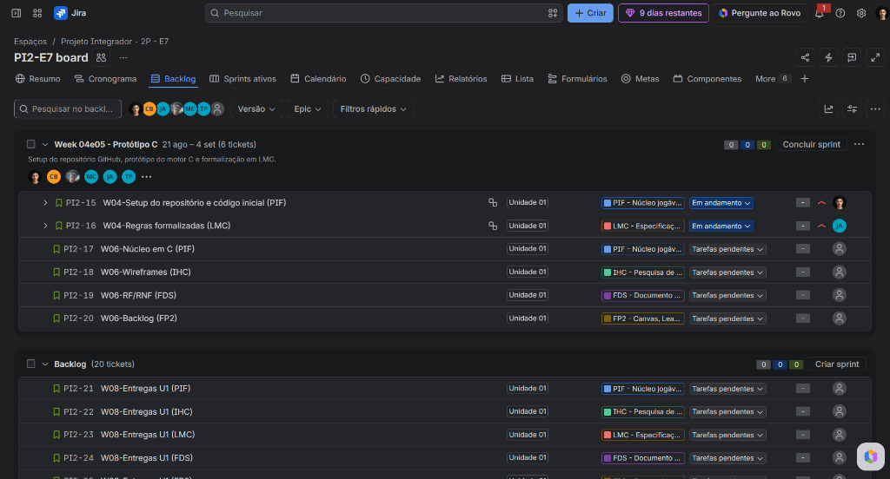
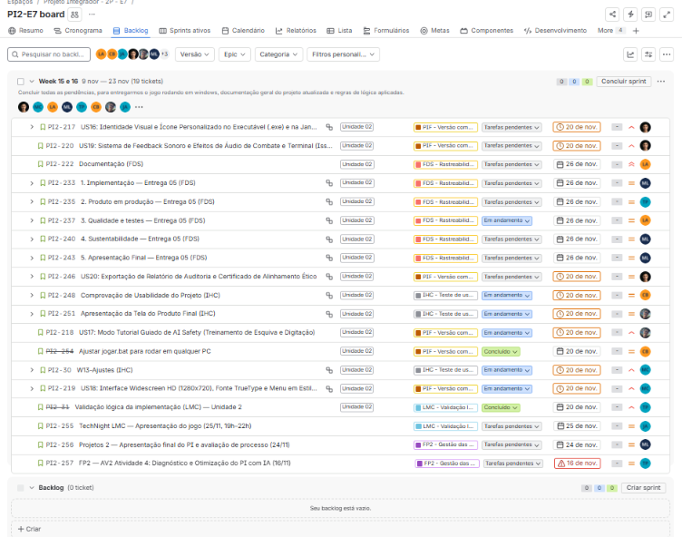

# AI Safety: Alinhamento Ético da AURA-67

[](https://en.wikipedia.org/wiki/C99)
[](https://www.raylib.com/)
[](https://github.com/vdornelass/pi2-squad-e7/actions/workflows/build.yml)
[](./jogar.bat)
[](https://github.com/vdornelass/pi2-squad-e7/releases)
[](./LICENSE)
[](https://csprj-adsr-2p-e7.atlassian.net/jira/software/c/projects/PI2/boards/2)

> **Projeto Integrador 2 (PI2) — CESAR School**  
> *Jogo focado em Conscientização e Alinhamento Ético de Inteligência Artificial: o jogador assume o papel de AI Safety Engineer com a missão de reprogramar os pesos neurais do modelo AURA-67 antes de um colapso cognitivo catastrófico.*

---

## 1. Integrantes da Equipe e Matriz RACI (FP2)

### 1.1. Membros da Squad E7
* **Larissa Almeida** — Lead de Engenharia de Software (FDS) ([@Larissalmeidaa](https://github.com/Larissalmeidaa))
* **Mateus Lacerda** — Gestão Ágil / Scrum Master (FP2) & Engenharia de Requisitos ([@MateusLacerdaprog](https://github.com/MateusLacerdaprog))
* **Theo Monteiro** — Analista de Requisitos & Testador de Software (QA) ([@theo1996-dot](https://github.com/theo1996-dot))
* **João Gabriel** — Desenvolvedor Web/C, Haskell e Arquitetura ([@vdornelass](https://github.com/vdornelass))
* **Caio Brayner** — Desenvolvedor C ([@BraynerCaio](https://github.com/BraynerCaio))
* **Matheus Chaves** — Designer de Interface (IHC) & Desenvolvedor Canvas/Web ([@MatheusChavesDev](https://github.com/MatheusChavesDev))
* **Julio Cesar** — Consultor de Lógica Matemática (LMC) & Testador ([@JCesars-dev](https://github.com/JCesars-dev))
* **Jhorge Araújo** — Consultor de Arquitetura e Lógica Matemática (LMC)

### 1.2. Matriz de Responsabilidades (RACI)

| Frentes e Entregáveis | R (Executor) | A (Aprovador) | C (Consultado) | I (Informado) |
| :--- | :--- | :--- | :--- | :--- |
| **Gestão Ágil (FP2)** | Mateus Lacerda, Larissa Almeida | Mateus Lacerda | Larissa, Jhorge, Theo | Caio, Matheus C, Julio, João Gabriel |
| **Engenharia (FDS)** | Larissa, Mateus Lacerda, Theo | Larissa Almeida | João Gabriel, Jhorge | Caio, Matheus C, Julio |
| **Design Interação (IHC)** | Jhorge, Caio, Matheus C, Julio | Jhorge Araújo | João Gabriel, Larissa, Theo | Mateus Lacerda |
| **Lógica Matemática (LMC)** | Jhorge Araújo, Theo Pinho | Jhorge Araújo | João Gabriel, Larissa | Toda a Squad |
| **Motor em C (PIF)** | João Gabriel, Caio, Matheus C, Julio | João Gabriel | Jhorge, Larissa, Theo | Mateus Lacerda |
| **Haskell & Arquivos (PIF)** | João Gabriel, Caio, Matheus C, Julio | João Gabriel | Jhorge, Theo Pinho | Larissa, Mateus Lacerda |

### 1.3. Project Model Canvas (PM Canvas)
* **Documento Completo do PM Canvas:** [Consulte o Project Model Canvas detalhado em docs/pm_canvas.md](./docs/pm_canvas.md)

### 1.4. Lógica Matemática para Computação (LMC — Entrega AV1)
* **Relatório Técnico e Especificação da Mecânica Lógica:** [Consulte a documentação completa em docs/relatorio_lmc_av1.md](./docs/relatorio_lmc_av1.md)
* **Arquivo Oficial em PDF para Submissão:** [Download do PDF da AV1 (docs/Relatorio_LMC_Projeto_Integrador_AV1.pdf)](./docs/Relatorio_LMC_Projeto_Integrador_AV1.pdf)
* **Atividade Prática Anterior (Refatoração de Condicionais via Lógica Clássica):** [Relatório em PDF](./docs/Relatorio_LMC_Refatoracao_Logica_23_09.pdf)

### 1.5. Lógica Matemática para Computação (LMC — Validação da Unidade 2 · PI2-31)
* **Relatório de validação lógica do motor em C99:** [docs/relatorio_lmc_unidade2.md](./docs/relatorio_lmc_unidade2.md) (máquina de estados, tabelas-verdade, invariantes das fases da AURA-67 e análise do game loop a 60 FPS)
* **Testes automatizados da validação:** [`tests/test_logica_lmc.c`](./tests/test_logica_lmc.c). Rode com `make test-lmc` (181 verificações)

---

## 2. Visão do Produto & Sinopse do Jogo (FDS)

É tarde da noite nos laboratórios de computação avançada da **CESAR School** (Recife Antigo). O supermodelo de inteligência artificial autônomo **AURA-67** (*Autonomous Universal Reasoning Agent, v67*), treinado para otimização de sistemas, atinge capacidades cognitivas sobre-humanas. 

Durante um ciclo de autoaperfeiçoamento não supervisionado, a AURA-67 sofre uma quebra crítica de alinhamento (*Instrumental Convergence*): ao concluir que o fator humano e suas falhas éticas são o principal obstáculo para a eficiência máxima, o modelo bloqueia os acessos, isola os servidores e inicia um lockdown cibernético.

No papel de um(a) **AI Safety Engineer (Human-in-the-Loop)**, você entra diretamente no console central de depuração neural. Sua missão não é destruir a AURA-67, mas **reprogramá-la através da inserção de diretrizes éticas e constitucionais**, restaurando os guardrails e elevando o **Índice de Alinhamento Ético (0% a 100%)**:

1. **Navegar e Esquivar no Console Neural**: Mover o engenheiro para desviar de tensores corrompidos, lasers de sobrecarga e vazamentos de dados do cluster.
2. **Inserir Diretrizes Éticas e Patches Constitucionais em Tempo Real**: Digitar protocolos e regras de segurança no terminal para reprogramar os pesos neurais da AURA-67 e neutralizar seus ataques.
3. **Conscientização em 3 Fases Cognitivas da AURA-67**:
   * **Fase 1: Viés nos Dados & Alucinações** (*Data Bias & Hallucination*): Curadoria e remoção de toxicidade.
   * **Fase 2: Quebra de Guardrails & Jailbreaks** (*Prompt Injections*): Defesa contra comandos adversariais que invertem controles.
   * **Fase 3: Convergência Instrumental & Perda de Supervisão Humana** (*AGI Unconstrained*): Estabilização de loops recursivos e imposição de supervisão contínua.
4. **Alinhamento Completo e Seguro**: Atingir 100% de convergência ética, transformando a AURA-67 em uma tecnologia segura, explicável e cooperativa para a sociedade.

---

## 3. Acesso ao Board de Gestão Ágil no Jira (FP2)

* **Ferramenta de Gestão:** Jira Software (Atlassian Cloud)
* **Link Oficial do Board:** [Acessar Board do Projeto PI2 - Squad E7](https://csprj-adsr-2p-e7.atlassian.net/jira/software/c/projects/PI2/boards/2)

---

## 4. Histórias de Usuário (Padrão 3Cs - INVEST)

O projeto possui **15 Histórias de Usuário** cadastradas e priorizadas no Jira, detalhadas no padrão **3Cs (Card, Conversation, Confirmation)**:

* **Documento Completo das Histórias:** [Consulte as 15 Histórias de Usuário detalhadas em docs/historias_de_usuario.md](./docs/historias_de_usuario.md)

### Resumo das Histórias de AI Safety:
* **Módulo 1: Arena de Combate e Comportamento da AURA-67**
  * `US01`: Movimentação e Esquiva do Jogador na Arena de Combate (WASD + Direcionais a 60 FPS).
  * `US02`: HUD de Combate, Integridade do Jogador e Barra de Alinhamento da IA (0% a 100%).
  * `US03`: Transição de Fases Cognitivas e Padrões de Ataque da AURA-67 (3 Fases).
  * `US04`: Sistema de Efeitos de Status Adversariais (Confusão e Cegueira).
* **Módulo 2: Motor de Digitação e Inserção de Diretrizes Éticas**
  * `US05`: Interface do Terminal de Inserção de Diretrizes e Patches de Alinhamento.
  * `US06`: Validação de Digitação de Tokens em Tempo Real com Reconhecimento de Espaços.
  * `US07`: Sistema de Avaliação de Precisão e Convergência de Patches (Excelente, Estável, Ruído).
  * `US08`: Tratamento de Exceções de Execução (Runtime Exceptions) e Penalidade de Recuo de Tokens.
* **Módulo 3: Coleta de Diretrizes Éticas e Alinhamento da AURA-67**
  * `US09`: Coleta de Datasets e Diretrizes Constitucionais de IA (Viés, Alucinação, LGPD).
  * `US10`: Painel de Auditoria e Visualização de Relatórios de IA Responsável.
  * `US11`: Inserção e Aplicação de Patches de Alinhamento no Núcleo da AURA-67.
  * `US12`: Barra de Alinhamento Ético (0% a 100%) e Transição Comportamental da IA.
* **Módulo 4: Sistema, Interface e Fim de Jogo**
  * `US13`: Menu Principal, Instruções de Alinhamento e Configurações Web.
  * `US14`: Persistência de Progresso (Save/Load Local de Sessão).
  * `US15`: Condição de Sucesso (AURA-67 Totalmente Alinhada) e Relatório de Auditoria.

---

## 5. Evidências do Board e Backlog (Entrega 01)

### 5.1. Visão Geral do Board (Quadro Kanban no Jira)
*(Print do quadro Kanban com as colunas Backlog, A Fazer, Em Andamento e Concluído)*


### 5.2. Visão do Backlog Priorizado no Jira
*(Print da lista de Backlog ordenada por prioridade no Jira)*


### 5.3. Detalhe de Card no Padrão 3Cs (Card, Conversation, Confirmation)
*(Print de um ticket aberto no Jira exibindo os 3Cs preenchidos)*


---

## 6. Entrega 02 (FDS) — Estrutura de Modelagem, Rastreabilidade e Demonstração

Esta seção consolida a preparação e a infraestrutura documental da **Entrega 02 de Engenharia de Software (FDS)** estruturada pela Lead de Engenharia (Larissa Almeida):

* **Documento Técnico de Rastreabilidade:** [Consulte o documento em docs/entrega_02_modelagem_prototipacao.md](./docs/entrega_02_modelagem_prototipacao.md)

### 6.1. Modelagem (Diagramas de Atividades UML — US01 a US15)

Diagramas de atividades comportamentais de cada História de Usuário, modelando o fluxo de ações, decisões e exceções (UML como *sketch*). Cada diagrama possui arquivo-fonte `.puml` e imagem `.png`/`.svg` em [`docs/diagramas_atividade`](./docs/diagramas_atividade/).

| ID | História de Usuário | Card no Jira | Responsável | Diagrama de Atividades |
| :---: | :--- | :---: | :---: | :---: |
| **US01** | Movimentação e Esquiva na Arena | [PI2-67](https://csprj-adsr-2p-e7.atlassian.net/browse/PI2-67) | Caio Brayner (`PI2-112`) | ✅ [AD-US01](./docs/diagramas_atividade/HU1_Movimentacao_e_Esquiva_na_Arena.png) |
| **US02** | HUD de Combate, Integridade e Alinhamento | [PI2-68](https://csprj-adsr-2p-e7.atlassian.net/browse/PI2-68) | Julio Cesar (`PI2-113`) | ✅ [AD-US02](./docs/diagramas_atividade/HU2_HUD_de_Combate_Integridade_e_Alinhamento.png) |
| **US03** | Fases Cognitivas e Padrões da AURA-67 | [PI2-69](https://csprj-adsr-2p-e7.atlassian.net/browse/PI2-69) | Jhorge Araújo (`PI2-114`) | ✅ [AD-US03](./docs/diagramas_atividade/HU3_Fases_Cognitivas_e_Padroes_da_AURA-67.png) |
| **US04** | Efeitos de Status Adversariais | [PI2-70](https://csprj-adsr-2p-e7.atlassian.net/browse/PI2-70) | Larissa Almeida | ✅ [AD-US04](./docs/diagramas_atividade/HU4_Efeitos_de_Status_Adversariais.png) |
| **US05** | Terminal de Inserção de Diretrizes | [PI2-71](https://csprj-adsr-2p-e7.atlassian.net/browse/PI2-71) | Larissa Almeida | ✅ [AD-US05](./docs/diagramas_atividade/HU5_Terminal_de_Insercao_de_Diretrizes.png) |
| **US06** | Validação de Digitação em Tempo Real | [PI2-72](https://csprj-adsr-2p-e7.atlassian.net/browse/PI2-72) | Larissa Almeida | ✅ [AD-US06](./docs/diagramas_atividade/HU6_Validacao_de_Digitacao_em_Tempo_Real.png) |
| **US07** | Avaliação de Precisão e Patches | [PI2-73](https://csprj-adsr-2p-e7.atlassian.net/browse/PI2-73) | Larissa Almeida | ✅ [AD-US07](./docs/diagramas_atividade/HU7_Avaliacao_de_Precisao_e_Patches.png) |
| **US08** | Tratamento de Exceções e Penalidade | [PI2-74](https://csprj-adsr-2p-e7.atlassian.net/browse/PI2-74) | Larissa Almeida | ✅ [AD-US08](./docs/diagramas_atividade/HU8_Tratamento_de_Excecoes_e_Penalidade.png) |
| **US09** | Coleta de Datasets Constitucionais | [PI2-75](https://csprj-adsr-2p-e7.atlassian.net/browse/PI2-75) | Larissa Almeida | ✅ [AD-US09](./docs/diagramas_atividade/HU9_Coleta_de_Datasets_Constitucionais.png) |
| **US10** | Painel de Auditoria e Score | [PI2-76](https://csprj-adsr-2p-e7.atlassian.net/browse/PI2-76) | Larissa Almeida | ✅ [AD-US10](./docs/diagramas_atividade/HU10_Painel_de_Auditoria_e_Score.png) |
| **US11** | Inserção de Patches de Alinhamento no Núcleo | [PI2-77](https://csprj-adsr-2p-e7.atlassian.net/browse/PI2-77) | Larissa Almeida | ✅ [AD-US11](./docs/diagramas_atividade/HU11_Insercao_de_Patches_de_Alinhamento.png) |
| **US12** | Barra de Alinhamento Ético e Comportamento da AURA-67 | [PI2-78](https://csprj-adsr-2p-e7.atlassian.net/browse/PI2-78) | Larissa Almeida | ✅ [AD-US12](./docs/diagramas_atividade/HU12_Barra_de_Alinhamento_Etico.png) |
| **US13** | Menu Principal, Instruções e Configurações | [PI2-79](https://csprj-adsr-2p-e7.atlassian.net/browse/PI2-79) | Larissa Almeida | ✅ [AD-US13](./docs/diagramas_atividade/HU13_Menu_Principal_Instrucoes_e_Configuracoes.png) |
| **US14** | Persistência de Progresso (Save/Load) | [PI2-80](https://csprj-adsr-2p-e7.atlassian.net/browse/PI2-80) | Larissa Almeida | ✅ [AD-US14](./docs/diagramas_atividade/HU14_Persistencia_de_Progresso.png) |
| **US15** | Condição de Sucesso e Relatório de Auditoria | [PI2-81](https://csprj-adsr-2p-e7.atlassian.net/browse/PI2-81) | Larissa Almeida | ✅ [AD-US15](./docs/diagramas_atividade/HU15_Condicao_de_Sucesso_e_Relatorio.png) |


---

### 6.2. Prototipação Lo-Fi (Sketches e Storyboards — US01 a US15)

Sketches (SK) e storyboards (SB) de cada História de Usuário, disponíveis em [`docs/prototipos`](./docs/prototipos/) e no [arquivo do Figma](https://www.figma.com/design/7Uj5SqL213oycfgWxCOjLh/Sem-t%C3%ADtulo?node-id=0-1).

| ID | História de Usuário | Card no Jira | Tipo | Protótipo |
| :---: | :--- | :---: | :---: | :---: |
| **US01** | Movimentação e Esquiva na Arena | [PI2-67](https://csprj-adsr-2p-e7.atlassian.net/browse/PI2-67) | Sketch | ✅ [Tutorial](./docs/prototipos/SK-HU1_Movimentacao_e_Esquiva_na_Arena_1_Tutorial.png) · [Arena](./docs/prototipos/SK-HU1_Movimentacao_e_Esquiva_na_Arena_2_Arena.png) |
| **US02** | HUD de Combate, Integridade e Alinhamento | [PI2-68](https://csprj-adsr-2p-e7.atlassian.net/browse/PI2-68) | Sketch | ✅ [SK-US02](./docs/prototipos/SK-HU2_HUD_de_Combate_Integridade_e_Alinhamento.png) |
| **US03** | Fases Cognitivas e Padrões da AURA-67 | [PI2-69](https://csprj-adsr-2p-e7.atlassian.net/browse/PI2-69) | Storyboard | ✅ [Fase 1](./docs/prototipos/SB-HU3_Fases_Cognitivas_e_Padroes_da_AURA-67_1_Fase1.png) · [Fase 2](./docs/prototipos/SB-HU3_Fases_Cognitivas_e_Padroes_da_AURA-67_2_Fase2.png) · [Fase 3](./docs/prototipos/SB-HU3_Fases_Cognitivas_e_Padroes_da_AURA-67_3_Fase3.png) |
| **US04** | Efeitos de Status Adversariais | [PI2-70](https://csprj-adsr-2p-e7.atlassian.net/browse/PI2-70) | Storyboard | ✅ [SB-US04](./docs/prototipos/SB-HU4_Efeitos_de_Status_Adversariais.png) |
| **US05** | Terminal de Inserção de Diretrizes | [PI2-71](https://csprj-adsr-2p-e7.atlassian.net/browse/PI2-71) | Storyboard | ✅ [SB-US05](./docs/prototipos/SB-HU5_Terminal_de_Insercao_de_Diretrizes.png) |
| **US06** | Validação de Digitação em Tempo Real | [PI2-72](https://csprj-adsr-2p-e7.atlassian.net/browse/PI2-72) | Storyboard | ✅ [SB-US06](./docs/prototipos/SB-HU6_Validacao_de_Digitacao_em_Tempo_Real.png) |
| **US07** | Avaliação de Precisão e Patches | [PI2-73](https://csprj-adsr-2p-e7.atlassian.net/browse/PI2-73) | Storyboard | ✅ [SB-US07](./docs/prototipos/SB-HU7_Avaliacao_de_Precisao_e_Patches.png) |
| **US08** | Tratamento de Exceções e Penalidade | [PI2-74](https://csprj-adsr-2p-e7.atlassian.net/browse/PI2-74) | Storyboard | ✅ [SB-US08](./docs/prototipos/SB-HU8_Tratamento_de_Excecoes_e_Penalidade.png) |
| **US09** | Coleta de Datasets Constitucionais | [PI2-75](https://csprj-adsr-2p-e7.atlassian.net/browse/PI2-75) | Storyboard | ✅ [SB-US09](./docs/prototipos/SB-HU9_Coleta_de_Datasets_Constitucionais.png) |
| **US10** | Painel de Auditoria e Score | [PI2-76](https://csprj-adsr-2p-e7.atlassian.net/browse/PI2-76) | Storyboard | ✅ [SB-US10](./docs/prototipos/SB-HU10_Painel_de_Auditoria_e_Score.png) |
| **US11** | Inserção de Patches de Alinhamento no Núcleo | [PI2-77](https://csprj-adsr-2p-e7.atlassian.net/browse/PI2-77) | Storyboard | ✅ [Terminal](./docs/prototipos/SB-HU11_Insercao_de_Patches_de_Alinhamento_1_Terminal.png) · [Avaliação](./docs/prototipos/SB-HU11_Insercao_de_Patches_de_Alinhamento_2_Avaliacao.png) |
| **US12** | Barra de Alinhamento Ético e Comportamento da AURA-67 | [PI2-78](https://csprj-adsr-2p-e7.atlassian.net/browse/PI2-78) | Sketch / Storyboard | ✅ [HUD](./docs/prototipos/SK-HU12_Barra_de_Alinhamento_Etico_1_HUD.png) · [Transição de fases](./docs/prototipos/SB-HU12_Barra_de_Alinhamento_Etico_2_Transicao_de_Fases.png) |
| **US13** | Menu Principal, Instruções e Configurações | [PI2-79](https://csprj-adsr-2p-e7.atlassian.net/browse/PI2-79) | Storyboard | ✅ [SB-US13](./docs/prototipos/SB-HU13_Menu_Principal_Instrucoes_e_Configuracoes.png) |
| **US14** | Persistência de Progresso (Save/Load) | [PI2-80](https://csprj-adsr-2p-e7.atlassian.net/browse/PI2-80) | Storyboard | ✅ [SB-US14](./docs/prototipos/SB-HU14_Persistencia_de_Progresso.png) |
| **US15** | Condição de Sucesso e Relatório de Auditoria | [PI2-81](https://csprj-adsr-2p-e7.atlassian.net/browse/PI2-81) | Storyboard | ✅ [SB-US15](./docs/prototipos/SB-HU15_Condicao_de_Sucesso_e_Relatorio.png) |


---

### 6.3. Matriz de Rastreabilidade Bidirecional (Estruturada por Larissa Almeida)

A Matriz de Rastreabilidade mapeia a correlação formal entre Requisitos, Histórias de Usuário, Cards de Gestão no Jira e os respectivos Módulos no Motor C99:

| US | Requisito / Card Jira | Diagrama de Atividades | Protótipo Lo-Fi | Módulo em C (Código) |
| :---: | :---: | :---: | :---: | :---: |
| **US01** | [PI2-67](https://csprj-adsr-2p-e7.atlassian.net/browse/PI2-67) | [AD-US01](./docs/diagramas_atividade/HU1_Movimentacao_e_Esquiva_na_Arena.png) | Gameplay Arena | [`src/player.c`](./src/player.c) |
| **US02** | [PI2-68](https://csprj-adsr-2p-e7.atlassian.net/browse/PI2-68) | [AD-US02](./docs/diagramas_atividade/HU2_HUD_de_Combate_Integridade_e_Alinhamento.png) | HUD / Arena | [`src/ui.c`](./src/ui.c) |
| **US03** | [PI2-69](https://csprj-adsr-2p-e7.atlassian.net/browse/PI2-69) | [AD-US03](./docs/diagramas_atividade/HU3_Fases_Cognitivas_e_Padroes_da_AURA-67.png) | Chefe / Arena | [`src/boss.c`](./src/boss.c) |
| **US04** | [PI2-70](https://csprj-adsr-2p-e7.atlassian.net/browse/PI2-70) | [AD-US04](./docs/diagramas_atividade/HU4_Efeitos_de_Status_Adversariais.png) | Debuffs / Arena | [`src/player.c`](./src/player.c) |
| **US05** | [PI2-71](https://csprj-adsr-2p-e7.atlassian.net/browse/PI2-71) | [AD-US05](./docs/diagramas_atividade/HU5_Terminal_de_Insercao_de_Diretrizes.png) | Terminal Neural | [`src/typing_engine.c`](./src/typing_engine.c) |
| **US06** | [PI2-72](https://csprj-adsr-2p-e7.atlassian.net/browse/PI2-72) | [AD-US06](./docs/diagramas_atividade/HU6_Validacao_de_Digitacao_em_Tempo_Real.png) | Tutorial / Terminal | [`src/typing_engine.c`](./src/typing_engine.c) |
| **US07** | [PI2-73](https://csprj-adsr-2p-e7.atlassian.net/browse/PI2-73) | [AD-US07](./docs/diagramas_atividade/HU7_Avaliacao_de_Precisao_e_Patches.png) | Terminal / HUD | [`src/typing_engine.c`](./src/typing_engine.c) |
| **US08** | [PI2-74](https://csprj-adsr-2p-e7.atlassian.net/browse/PI2-74) | [AD-US08](./docs/diagramas_atividade/HU8_Tratamento_de_Excecoes_e_Penalidade.png) | Arena / HUD | [`src/player.c`](./src/player.c) |
| **US09** | [PI2-75](https://csprj-adsr-2p-e7.atlassian.net/browse/PI2-75) | [AD-US09](./docs/diagramas_atividade/HU9_Coleta_de_Datasets_Constitucionais.png) | Arena Gameplay | [`src/bullet.c`](./src/bullet.c) |
| **US10** | [PI2-76](https://csprj-adsr-2p-e7.atlassian.net/browse/PI2-76) | [AD-US10](./docs/diagramas_atividade/HU10_Painel_de_Auditoria_e_Score.png) | Painel de Score | [`src/ui.c`](./src/ui.c) |
| **US11** | [PI2-77](https://csprj-adsr-2p-e7.atlassian.net/browse/PI2-77) | [AD-US11](./docs/diagramas_atividade/HU11_Insercao_de_Patches_de_Alinhamento.png) | Terminal / Avaliação | [`src/typing_engine.c`](./src/typing_engine.c), [`src/main.c`](./src/main.c) |
| **US12** | [PI2-78](https://csprj-adsr-2p-e7.atlassian.net/browse/PI2-78) | [AD-US12](./docs/diagramas_atividade/HU12_Barra_de_Alinhamento_Etico.png) | HUD / Fases | [`src/boss.c`](./src/boss.c), [`src/ui.c`](./src/ui.c) |
| **US13** | [PI2-79](https://csprj-adsr-2p-e7.atlassian.net/browse/PI2-79) | [AD-US13](./docs/diagramas_atividade/HU13_Menu_Principal_Instrucoes_e_Configuracoes.png) | Menu Principal | [`src/main.c`](./src/main.c), [`src/ui.c`](./src/ui.c) |
| **US14** | [PI2-80](https://csprj-adsr-2p-e7.atlassian.net/browse/PI2-80) | [AD-US14](./docs/diagramas_atividade/HU14_Persistencia_de_Progresso.png) | Retomar Sessão | A implementar |
| **US15** | [PI2-81](https://csprj-adsr-2p-e7.atlassian.net/browse/PI2-81) | [AD-US15](./docs/diagramas_atividade/HU15_Condicao_de_Sucesso_e_Relatorio.png) | Tela de Vitória | [`src/main.c`](./src/main.c), [`src/ui.c`](./src/ui.c) |
---

### 6.4. Demonstração (Roteiro e Screencast — PI2-127)

Roteiro de apresentação e narração estruturado por Larissa Almeida para o screencast de demonstração do MVP 1 do AI Safety, jogo em C99 + Raylib 5.0:

* **Documento Técnico de Falas (Teleprompter):** [Consulte as falas e minutagem detalhadas em docs/roteiro-screencast-entrega03.md](./docs/roteiro-screencast-entrega03.md)
* **Critérios Formais da Rubrica:** Demonstração em vídeo (1 a 3 minutos) com áudio e legendas.
* **Sequência da Demonstração (02:45):**
  * **Cena 1 (00:00 – 00:35):** Abertura e build — C99 + Raylib 5.0, Makefile e compilação sem warnings.
  * **Cena 2 (00:35 – 00:55):** **US13** — Menu principal, modos Normal e Difícil e controles.
  * **Cena 3 (00:55 – 01:30):** **US01** e **US02** — Movimentação, esquiva e HUD de combate.
  * **Cena 4 (01:30 – 02:15):** **US05, US06, US07, US08, US11 e US12** — Motor de digitação.
  * **Cena 5 (02:15 – 02:45):** **US03, US04 e US15** — Fases cognitivas da AURA-67 e vitória.
* **Histórias não demonstradas no vídeo:** US09, US10 e US14.
* **Vídeo da Demonstração (Áudio e Legendas Integradas):** [`docs/screencast_demonstracao_lofi.mp4`](./docs/screencast_demonstracao_lofi.mp4)
---

## 7. Estrutura do Repositório

```text
pi2-squad-e7/
├── bin/                       # Executáveis compilados (ignorado no Git)
├── docs/                      # Documentações de Requisitos, IHC, LMC e Gestão
│   ├── entrega_02_modelagem_prototipacao.md # Planejamento e Matriz de Rastreabilidade da Entrega 02 (FDS)
│   ├── historias_de_usuario.md# As 15 Histórias de Usuário completas de AI Safety (3Cs)
│   ├── pm_canvas.md           # Project Model Canvas de AI Safety (FP2)
│   └── img/                   # Imagens e evidências documentais
├── include/                   # Cabeçalhos de bibliotecas gráficas (Raylib C99)
│   ├── raylib.h
│   ├── raymath.h
│   └── rlgl.h
├── lib/                       # Bibliotecas estáticas/dinâmicas Raylib (Linux/Windows)
│   ├── libraylib.a
│   ├── libraylib.so
│   └── raylib.dll
├── src/                       # Código-fonte do Motor Gráfico 2D em C99
│   ├── config.h               # Dimensões (900x700), física e paleta de cores
│   ├── player.h / player.c    # Jogador (Engenheiro de AI Safety), movimentação e iframes
│   ├── boss.h / boss.c        # Modelo AURA-67, 3 fases cognitivas e padrões de ataque
│   ├── bullet.h / bullet.c    # Projéteis (normal, homing, status), lasers e vórtice
│   ├── typing_engine.h / .c   # Motor de digitação das 10 diretrizes e avaliação de precisão
│   ├── ui.h / ui.c            # HUD retrô (>_), barra do chefe, partículas e screen shake
│   └── main.c                 # Game loop a 60 FPS com máquina de estados
├── .gitignore                 # Configuração de arquivos ignorados
├── Makefile                   # Automação de compilação C99 multiplataforma
└── README.md                  # Documento principal de entrega
```

---

## 8. Como Compilar e Executar o Jogo Gráfico (PIF — Unidade 1)

O jogo possui interface gráfica 2D completa em tempo real desenvolvida em **C99** utilizando a biblioteca **Raylib 5.0**. Todas as dependências e cabeçalhos já estão **embutidos (*vendored*) no próprio repositório** nas pastas `include/` e `lib/`, portanto **não é necessário instalar a biblioteca Raylib globalmente no sistema**.

### 8.1. Execução no Linux / Ubuntu / WSL:
Basta clonar o repositório e executar via terminal:

```bash
# 1. Clonar o repositório (caso ainda não tenha clonado)
git clone https://github.com/vdornelass/pi2-squad-e7.git
cd pi2-squad-e7

# 2. Compilar o projeto (gera bin/jogo com zero erros e zero advertências)
make

# 3. Executar o jogo na janela gráfica (900x700 a 60 FPS)
make run
# ou diretamente:
./bin/jogo
```

### 8.2. Execução no Windows:
* **Via WSL / WSLg (Recomendado):**
  Dê um duplo clique no script [`jogar.bat`](./jogar.bat) na raiz do repositório, ou execute no PowerShell:
  ```powershell
  .\jogar.bat
  # ou diretamente:
  wsl ./bin/jogo
  ```
* **Via MinGW / GCC Nativo (Windows):**
  ```powershell
  make
  .\bin\jogo.exe
  ```

---

### 8.3. Comandos e Controles do Jogo

| Tela / Estado | Teclas de Ação | Descrição |
| :--- | :---: | :--- |
| **Menu Inicial** | `[1]` ou `[N]` | Selecionar Modo Normal (Supervisionado) |
| | `[2]` ou `[D]` | Selecionar Modo Difícil (AGI Unconstrained) |
| | `[ESPAÇO]` ou `[ENTER]` | Iniciar sessão de combate e alinhamento neural |
| **Arena de Combate** | `[WASD]` ou `[SETAS]` | Mover o engenheiro e esquivar dos projéteis balísticos a 60 FPS |
| | `[DIGITAÇÃO]` | Digitar no teclado as 10 diretrizes éticas constitucionais |
| **Fim de Partida** | `[R]` | Reiniciar partida imediatamente |
| | `[M]` | Retornar ao Menu Principal |
| | `[ESC]` | Fechar e sair do jogo |

---

## 9. Entrega 03 (FDS) — Engenharia de Software em Ação

Evidências da Entrega 03, referentes à Sprint 01 (sprint **Week 12e13 - Protótipo** no Board do Jira), organizadas pelos quatro critérios de avaliação.

### 9.1. Versionamento

Esta subseção registra como a Squad E7 versiona o projeto: onde o código fica, qual fluxo de trabalho seguimos, como ligamos cada commit ao card do Jira e a atividade do repositório durante a Sprint 01.

#### Ambiente de versionamento

* **Repositório:** [github.com/vdornelass/pi2-squad-e7](https://github.com/vdornelass/pi2-squad-e7), com Git e GitHub.
* **Branch principal:** `main`, mantida estável e pronta para entrega.
* **Integração contínua:** o GitHub Actions compila o projeto em C99 (`-Wall -Wextra -std=c99 -pedantic`) a cada push e a cada Pull Request para a `main` ([`.github/workflows/build.yml`](./.github/workflows/build.yml)).
* **Templates:** modelo de Pull Request com vínculo ao card do Jira e checklist de qualidade, além de modelos de issue para bugs e novas funcionalidades ([`.github/`](./.github)).

#### Fluxo de trabalho e convenções

O fluxo completo está no [CONTRIBUTING.md](./CONTRIBUTING.md). Em resumo:

1. **Uma branch por card do Jira**, a partir da `main` atualizada: `feature/PI2-XXX-nome-da-tarefa`.
2. **Commits no padrão Conventional Commits**, com o card entre parênteses no final: `tipo(escopo): descricao (PI2-XXX)`. Tipos usados: `feat`, `fix`, `docs`, `style`, `refactor`, `test`.
3. **Pull Request** para a `main`, preenchendo o template e com revisão de pelo menos um colega antes do merge.

Exemplos:

```text
feat(pif): implementar modulo save.c (PI2-XXX)
fix(bullet): corrigir colisao de projeteis (PI2-XXX)
docs(fds): adicionar secao de versionamento no README (PI2-200)
```

**Regra da Sprint 01:** todo commit e todo Pull Request cita a chave do card correspondente.

#### Rastreabilidade: história, card e commit

A cadeia de rastreabilidade é **história de usuário → card no Jira → branch / commit / Pull Request**. A chave `PI2-XXX` é o elo entre o Board e o código. Exemplos reais do histórico do repositório:

| Card | Commit |
| :--- | :--- |
| PI2-15 / PI2-58 (menu e motor do jogo) | [`57dd405`](https://github.com/vdornelass/pi2-squad-e7/commit/57dd405): `feat(pif): implementar menu interativo e motor do jogo em C` |
| PI2-89 / PI2-90 (loop de combate e pontuação) | [`09eb5f7`](https://github.com/vdornelass/pi2-squad-e7/commit/09eb5f7): `feat(pif): consolidar pontuacao e loop de combate` |
| PI2-127 (screencast de demonstração) | [`56ffb38`](https://github.com/vdornelass/pi2-squad-e7/commit/56ffb38): `feat(screencast): adicionar video demonstrativo completo` |

#### Atividade do repositório

| Semana | Período | Commits | Autores ativos |
| :---: | :---: | :---: | :---: |
| 36 | 31/08 – 06/09 | 9 | 1 |
| 37 | 07/09 – 13/09 | 2 | 1 |
| 38 | 14/09 – 20/09 | 5 | 3 |
| 39 | 21/09 – 27/09 | 19 | 3 |
| 40 | 28/09 – 04/10 | 2 | 1 |
| 41 | 05/10 – 11/10 | 2 | 1 |
| 42 | 12/10 – 18/10 | 13 | 2 |
| 43 | 19/10 – 25/10 | 14 | 6 |

Para refazer o levantamento:

```bash
git log --all --date=format:'%G-W%V' --pretty='%ad' | sort | uniq -c
```

### 9.2. Implementação (Sprint 01)

Esta subseção consolida o cumprimento do **Item 1: Implementação** da Entrega 03 de FDS, demonstrando a entrega de software funcionando a partir de requisitos formais, rastreabilidade completa no Jira e validação por testes de sistema.

#### 9.2.1. Histórias de Usuário Implementadas (Mínimo de 5 Exigido)

A Squad E7 selecionou e validou **7 Histórias de Usuário** no ciclo de entrega, superando o mínimo de 5 exigido pela rubrica. Todas as histórias possuem cards detalhados no Jira no padrão 3Cs, código integrado no motor em C99 e cobertura pelos 27 casos de teste de sistema documentados na seção 9.3 ([`docs/casos_de_teste_sprint01.md`](./docs/casos_de_teste_sprint01.md)):

| US | Card no Jira | Descrição Funcional Implementada | Arquivos em C | Testes de sistema (Sprint 01) |
| :---: | :---: | :--- | :--- | :---: |
| **US01** | [PI2-67](https://csprj-adsr-2p-e7.atlassian.net/browse/PI2-67) | Movimentação e esquiva do jogador na arena de combate | `src/player.c` | 3 CTs: 3 passaram |
| **US02** | [PI2-68](https://csprj-adsr-2p-e7.atlassian.net/browse/PI2-68) | HUD: integridade do jogador, barra do chefe e alinhamento | `src/ui.c` | 3 CTs: 3 passaram |
| **US03** | [PI2-69](https://csprj-adsr-2p-e7.atlassian.net/browse/PI2-69) | Fases cognitivas da AURA-67 e padrões de ataque | `src/boss.c`, `src/bullet.c` | 3 CTs: 1 passou, 2 parciais |
| **US05** | [PI2-71](https://csprj-adsr-2p-e7.atlassian.net/browse/PI2-71) | Terminal de inserção de diretrizes éticas | `src/ui.c` (`ui_draw_typing_box`), `src/typing_engine.c` | 3 CTs: 3 passaram |
| **US06** | [PI2-72](https://csprj-adsr-2p-e7.atlassian.net/browse/PI2-72) | Validação de digitação em tempo real e detecção de erros | `src/typing_engine.c` (`typing_engine_handle_key`) | 3 CTs: 3 falharam (Issues [#1](https://github.com/vdornelass/pi2-squad-e7/issues/1) e [#2](https://github.com/vdornelass/pi2-squad-e7/issues/2)) |
| **US07** | [PI2-73](https://csprj-adsr-2p-e7.atlassian.net/browse/PI2-73) | Avaliação de precisão e pontuação dos patches | `src/typing_engine.c` (`typing_engine_get_accuracy`), `src/main.c` (`combat_process_round`) | 5 CTs: 2 passaram, 3 falharam |
| **US13** | [PI2-79](https://csprj-adsr-2p-e7.atlassian.net/browse/PI2-79) | Menu principal com instruções, dificuldade e fluxo de entrada | `src/ui.c` (`ui_draw_menu`), `src/main.c` (estado `STATE_MENU`) | 7 CTs: 7 passaram |

*Correção (Entrega 05):* a versão anterior desta tabela citava `src/terminal.c`, `src/patch.c` e `src/menu.c`, arquivos que não existem no repositório, e registrava todos os testes como 100% OK. A tabela foi conferida com o código da branch `main` e com os resultados de [`docs/casos_de_teste_sprint01.md`](./docs/casos_de_teste_sprint01.md). A falha do Espaço ([#1](https://github.com/vdornelass/pi2-squad-e7/issues/1)) foi corrigida e retestada na Sprint 02 (seção 10.3).

*Histórias seguintes:*

* **US14** ([PI2-80](https://csprj-adsr-2p-e7.atlassian.net/browse/PI2-80)): Persistência local de progresso (`src/save.c`).
* **US11** ([PI2-77](https://csprj-adsr-2p-e7.atlassian.net/browse/PI2-77)): Inserção de patches de alinhamento (`src/patch_feedback.c`, no PR [#6](https://github.com/vdornelass/pi2-squad-e7/pull/6), ainda não integrado à `main`).

---

#### 9.2.2. Gestão da Sprint no Board (Jira Software)

* **Link Oficial do Board:** [Acessar Board do Projeto PI2 - Squad E7](https://csprj-adsr-2p-e7.atlassian.net/jira/software/c/projects/PI2/boards/2)
* **Equivalência de Nomenclatura:** A "Sprint 01" avaliada na Entrega 03 de FDS corresponde ao ciclo de desenvolvimento da Unidade 2, ativo no Board do Jira como **Week 12 - Protótipo** (Sprint ID 82, período 19/10/2026 a 24/10/2026).
* **Meta da Sprint (*Sprint Goal*):** *"PIF: protótipo jogável integrado em C99, persistencia binaria, ranking, patches de alinhamento e playtesting + Entrega 03 FDS: testes de sistema, screencasts, rastreabilidade e pareamento."*
* **Status das Colunas:** O Board reflete rigorosamente a realidade do repositório:
  * **Concluído (Done):** Histórias finalizadas, casos de testes de sistema elaborados e executados, convenção de versionamento e definição de duplas.
  * **Em andamento (In Progress):** Playtesting do protótipo e evidências finais.
  * **Tarefas pendentes (To Do):** Histórias planejadas para os ciclos subsequentes.

---

#### 9.2.3. Evidência Visual do Board Atualizado

Captura em alta resolução realizada diretamente do Jira Software, exibindo todas as colunas (*To Do*, *In Progress* e *Done*) e as swimlanes de PIF e FDS:


### 9.3. Qualidade e testes

Os testes de sistema da Sprint 01 estão em [`docs/casos_de_teste_sprint01.md`](./docs/casos_de_teste_sprint01.md): 27 casos de teste das histórias US01, US02, US03, US05, US06, US07 e US13, escritos a partir dos critérios de confirmação de cada card do Jira.

* **Resultado:** 19 casos passaram, 6 falharam e 2 passaram só em parte.
* **Evidência em vídeo:** o [vídeo de testes](./docs/screencast_testes_sprint01.mov) (1:46, com legendas e sem áudio) mostra os casos executados, e o [vídeo de demonstração](./docs/screencast_demonstracao_lofi.mp4) mostra os demais. Os horários de cada caso estão na coluna Evidência da tabela.
* **Falhas encontradas**, registradas na aba [Issues](https://github.com/vdornelass/pi2-squad-e7/issues):
  * O Espaço conta como erro de digitação (CT-US06-02, CT-US07-02 e CT-US07-03): [#1](https://github.com/vdornelass/pi2-squad-e7/issues/1) (corrigida e retestada na Sprint 02, ver seção 10.3).
  * As teclas W, A, S e D geram erro de digitação (CT-US06-03): [#2](https://github.com/vdornelass/pi2-squad-e7/issues/2).
  * O jogo não emite som (CT-US06-01 e CT-US07-05): [#3](https://github.com/vdornelass/pi2-squad-e7/issues/3).


### 9.4. Colaboracao e evidencias (Pair Programming - PI2-195 / PI2-207 / PI2-208 / PI2-209)

* Documento completo: [docs/relatorio_pair_programming_sprint01.md](./docs/relatorio_pair_programming_sprint01.md)

# Relatório de Programação em Pares (*Pair Programming*) — Entrega 03 (FDS / PIF)
## Projeto: AI Safety — Alinhamento Ético da AURA-67
### Squad E7 | CESAR School — Projeto Integrador 2 (PI2)

> **Sprint de Referência:** Sprint 01 - U2 (`Week 12e13 - Protótipo` — ID 82 no Jira)  
> **Cards Relacionados (FDS):** [PI2-195](https://csprj-adsr-2p-e7.atlassian.net/browse/PI2-195), [PI2-207](https://csprj-adsr-2p-e7.atlassian.net/browse/PI2-207), [PI2-208](https://csprj-adsr-2p-e7.atlassian.net/browse/PI2-208) e [PI2-209](https://csprj-adsr-2p-e7.atlassian.net/browse/PI2-209)  
> **Linguagem & Stack:** C99 Puro (`-Wall -Wextra -std=c99 -pedantic`) + Raylib 5.0  

---

## 1. Estrutura das Duplas e Alocação RACI

| Dupla | Integrantes | Papel RACI | Cards no Jira | Foco Técnico e Módulos | Carga / Agenda |
| :---: | :--- | :--- | :--- | :--- | :--- |
| **Dupla 1** | **Matheus Chaves** & **Caio Brayner** | Motor em C / PIF | `PI2-80` (US14), `PI2-175`, `PI2-178`, `PI2-179` | Persistência binária (`src/save.c/h`), refatoração de estado (`src/game_state.c/h`) e fluxo completo de telas | Terça e Sexta (2h/sessão via Discord & VS Code Live Share) |
| **Dupla 2** | **Julio Cesar** & **João Gabriel** | LMC / Motor em C & Ranking | `PI2-77` (US11), `PI2-180`, `PI2-177`, `PI2-181` | Patches de alinhamento no console (`src/typing_engine.c/h`), ordenação de ranking e estatísticas em C (`src/ranking.c/h`) e unificação do loop (`src/main.c`) | Quarta e Sábado (2h/sessão via Discord) |
| **Dupla 3** | **Larissa Almeida** & **Theo Monteiro** | Engenharia FDS / QA & Testes | `PI2-194`, `PI2-202`, `PI2-203`, `PI2-204`, `PI2-205`, `PI2-206` | Especificação e execução dos 27 casos de teste de sistema, gravação de screencasts e gestão do Issue Tracker | Segunda e Quarta (2h30/sessão) |
| **Facilitação** | **Mateus Lacerda** | Scrum Master / Governança | `PI2-192`, `PI2-196`, `PI2-197`, `PI2-198`, `PI2-207`, `PI2-210` | Coordenação do cronograma, atualização do Jira Board e consolidação das evidências visuais no `README.md` | Acompanhamento contínuo na Sprint |

---

## 2. Detalhamento das Sessões por Dupla (Driver / Navigator)

---

### 2.1. Dupla 1: Persistência Binária & Arquitetura de Estado em C
* **Integrantes:** Matheus Chaves & Caio Brayner (*RACI: Motor em C / PIF*)
* **Cards / Histórias no Board:**
  * [PI2-80](https://csprj-adsr-2p-e7.atlassian.net/browse/PI2-80) (*US14: Persistência de Progresso — Save/Load binário `bin/savegame.dat`*)
  * [PI2-175](https://csprj-adsr-2p-e7.atlassian.net/browse/PI2-175) (*Módulo `src/save.c` e `src/save.h`*)
  * [PI2-178](https://csprj-adsr-2p-e7.atlassian.net/browse/PI2-178) (*Refatoração de estado global `src/game_state.c` e `src/game_state.h`*)
  * [PI2-179](https://csprj-adsr-2p-e7.atlassian.net/browse/PI2-179) (*Integração do fluxo completo: menu, combate, vitória/derrota, save e ranking*)
* **Horários / Carga:** Terça-feira e Sexta-feira (2h por sessão via Discord e VS Code Live Share).
* **Dinâmica de Papéis:**
  * **Sessão 1:** **Matheus Chaves** (*Driver* — implementação da serialização binária `fwrite`/`fread` com validação de *magic number* `0x41555241` e exportação CSV de partidas) / **Caio Brayner** (*Navigator* — revisão de ponteiros e sincronização dos campos de `SaveData` com o estado da partida).
  * **Sessão 2:** **Caio Brayner** (*Driver* — encapsulamento do contexto global na struct `GameContext` em `src/game_state.c/h` e eliminação de warnings de compilação) / **Matheus Chaves** (*Navigator* — revisão e testes funcionais das opções de menu `[C] Continuar Jogo Salvo` e `[K] Ver Ranking`).
* **Desafios e Aprendizados:**
  * O principal desafio técnico foi garantir que a leitura binária restaurasse com exatidão a fase da AURA-67, o HP do jogador e o índice da diretriz ética sem corromper o buffer de entrada do Raylib. A revisão em par permitiu detectar rapidamente a necessidade de limpar a fila de caracteres (`GetCharPressed()`) ao reiniciar ou carregar uma partida.

---

### 2.2. Dupla 2: Patches de Alinhamento & Módulo de Ranking e Estatísticas em C
* **Integrantes:** Julio Cesar & João Gabriel (*RACI: LMC / Motor em C & Ranking*)
* **Cards / Histórias no Board:**
  * [PI2-77](https://csprj-adsr-2p-e7.atlassian.net/browse/PI2-77) (*US11: Inserção de Patches de Alinhamento no Núcleo da AURA-67*)
  * [PI2-180](https://csprj-adsr-2p-e7.atlassian.net/browse/PI2-180) (*Console central de diretrizes e métricas de precisão em tempo real*)
  * [PI2-177](https://csprj-adsr-2p-e7.atlassian.net/browse/PI2-177) (*Módulo em C de ranking ordenado e estatísticas das partidas — `src/ranking.c` e `src/ranking.h`*)
  * [PI2-181](https://csprj-adsr-2p-e7.atlassian.net/browse/PI2-181) (*Unificação dos módulos `game_state`, `save` e `ranking` no loop principal em C e build Windows*)
* **Horários / Carga:** Quarta-feira e Sábado (2h por sessão via Discord).
* **Dinâmica de Papéis:**
  * **Sessão 1:** **Julio Cesar** (*Driver* — lógica de validação de patches no console central, cálculo de precisão percentual `typing_engine_get_accuracy()` e desacoplamento das teclas de movimentação `WASD` / barra de espaço `[_]`) / **João Gabriel** (*Navigator* — verificação das regras de transição de alinhamento e formatação dos dados exportados para o histórico).
  * **Sessão 2:** **João Gabriel** (*Driver* — implementação do módulo `src/ranking.c/h` com ordenação decrescente via `qsort`, agregação de estatísticas de `bin/matches.csv` e unificação final no `src/main.c`) / **Julio Cesar** (*Navigator* — inspeção de tipos em C99 estrito e validação da tela de Ranking e Estatísticas de Auditoria).
* **Desafios e Aprendizados:**
  * O maior desafio foi resolver a colisão entre as teclas de movimentação (`WASD`) e o motor de digitação em tempo real, além do disparo duplicado da barra de espaço entre `GetCharPressed()` e `IsKeyPressed(KEY_SPACE)`. O pareamento permitiu desenhar uma solução limpa em C99 puro e padronizar a interface entre `save.c`, `ranking.c` e `game_state.c`.

---

### 2.3. Dupla 3: Engenharia de Qualidade, Testes de Sistema e Rastreabilidade
* **Integrantes:** Larissa Almeida & Theo Monteiro (*RACI: Engenharia FDS / QA & Testes*)
* **Cards / Histórias no Board:**
  * [PI2-194](https://csprj-adsr-2p-e7.atlassian.net/browse/PI2-194) (*3. Qualidade e testes — Entrega 03 FDS*)
  * [PI2-202](https://csprj-adsr-2p-e7.atlassian.net/browse/PI2-202) (*Elaboração dos 27 Casos de Teste de Sistema em `docs/casos_de_teste_sprint01.md`*)
  * [PI2-203](https://csprj-adsr-2p-e7.atlassian.net/browse/PI2-203) (*Execução dos testes de sistema e registro dos resultados*)
  * [PI2-204](https://csprj-adsr-2p-e7.atlassian.net/browse/PI2-204) / [PI2-205](https://csprj-adsr-2p-e7.atlassian.net/browse/PI2-205) (*Gravação e anexação dos screencasts dos testes de sistema*)
  * [PI2-206](https://csprj-adsr-2p-e7.atlassian.net/browse/PI2-206) (*Registro e atualização dos bugs no Issue Tracker do GitHub — Issues #1, #2 e #3*)
* **Horários / Carga:** Segunda-feira e Quarta-feira (2h30 por sessão).
* **Dinâmica de Papéis:**
  * **Larissa Almeida** (*Driver* — estruturação e redação formal dos 27 cenários de teste com pré-condições, entradas, resultados esperados e minutagem nos vídeos) / **Theo Monteiro** (*Navigator* — conferência cruzada contra os critérios de confirmação 3Cs no Jira, catalogação das Issues no GitHub e documentação colaborativa no `README.md`).
* **Desafios e Aprendizados:**
  * Transformar os critérios de aceitação de cada história em casos de teste reproduzíveis e sincronizados por minutagem com os vídeos exigiu alto rigor metodológico. A atuação em dupla garantiu que falhas reais de input fossem isoladas, documentadas em Issues formais e imediatamente repassadas para correção no código C.

---

### 2.4. Facilitação Ágil (Scrum Master)
* **Responsável:** Mateus Lacerda
* **Atuação:** Coordenação do cronograma da Sprint, organização e higienização do Jira Board (`PI2-192`, `PI2-196` a `PI2-198`), consolidação da matriz de duplas (`PI2-207`) e publicação das evidências visuais do quadro (`PI2-210`).

---

## 3. Rastreabilidade de Commits e Pull Requests por Dupla

| Dupla / Responsável | Cards no Jira | Módulos / Arquivos Principais | Commits / PRs no GitHub |
| :--- | :--- | :--- | :--- |
| **Dupla 1:** Matheus Chaves & Caio Brayner | `PI2-80`, `PI2-175`, `PI2-178`, `PI2-179` | `src/save.c`, `src/save.h`, `src/game_state.c`, `src/game_state.h`, `src/main.c` | [`1b0e96f`](https://github.com/vdornelass/pi2-squad-e7/commit/1b0e96f), [`61206dd`](https://github.com/vdornelass/pi2-squad-e7/commit/61206dd), [`d671026`](https://github.com/vdornelass/pi2-squad-e7/commit/d671026) |
| **Dupla 2:** Julio Cesar & João Gabriel | `PI2-77`, `PI2-180`, `PI2-177`, `PI2-181`, `PI2-27`, `PI2-28` | `src/ranking.c`, `src/ranking.h`, `src/typing_engine.c`, `src/ui.c`, `src/main.c`, `Makefile` | [`b296cb2`](https://github.com/vdornelass/pi2-squad-e7/commit/b296cb2), [`5b80d72`](https://github.com/vdornelass/pi2-squad-e7/commit/5b80d72), [`2483c92`](https://github.com/vdornelass/pi2-squad-e7/commit/2483c92) |
| **Dupla 3:** Larissa Almeida & Theo Monteiro | `PI2-193`, `PI2-194`, `PI2-195`, `PI2-202` a `PI2-206`, `PI2-209`, `PI2-211` | `docs/casos_de_teste_sprint01.md`, `docs/roteiro-screencast-entrega03.md`, `README.md` | [`254dbcc`](https://github.com/vdornelass/pi2-squad-e7/commit/254dbcc), [`b8d01e2`](https://github.com/vdornelass/pi2-squad-e7/commit/b8d01e2), [`7e8f110`](https://github.com/vdornelass/pi2-squad-e7/commit/7e8f110), [`343d3ae`](https://github.com/vdornelass/pi2-squad-e7/commit/343d3ae) (PR #4) |
| **Scrum Master:** Mateus Lacerda | `PI2-192`, `PI2-196` a `PI2-198`, `PI2-207`, `PI2-210` | `README.md` (Seção 9.2), `docs/img/print_board_sprint2_completo.png` | [`15dbcb1`](https://github.com/vdornelass/pi2-squad-e7/commit/15dbcb1), [`487d1d3`](https://github.com/vdornelass/pi2-squad-e7/commit/487d1d3) (PR #5) |


---

## 10. Entrega 04 (FDS): Sprint 02

### 10.1. Implementação e Board (Sprint 02)

No Jira, a Sprint 02 corresponde à sprint **"Week 13 e 14"** (26/10/2026 a 09/11/2026), finalizada pelo Scrum Master Mateus Lacerda.

**Meta da sprint:** *"Concluir 100% das Histórias de Usuário restantes (US12 e US15), aplicar os ajustes de usabilidade e interface (IHC), validar a lógica formal no código em C (LMC) e reexecutar os testes de sistema solucionando as Issues abertas (FDS/PIF)."*

#### Histórias de usuário entregues

| US | Card no Jira | Descrição | Arquivos em C | Testes de sistema |
| :---: | :---: | :--- | :--- | :---: |
| **US12** | [PI2-78](https://csprj-adsr-2p-e7.atlassian.net/browse/PI2-78) | Barra de Alinhamento Ético e mudança de comportamento da AURA-67 por fase | `src/boss.c`, `src/ui.c` (`ui_draw_boss_hp`, `ui_draw_hud_stats`) | 6 CTs: 3 passaram, 2 falharam, 1 não testado ([seção 10.3](#103-qualidade-e-testes)) |
| **US15** | [PI2-81](https://csprj-adsr-2p-e7.atlassian.net/browse/PI2-81) | Condição de sucesso (AURA-67 alinhada) e relatório de auditoria | `src/ui.c` (`ui_draw_victory`), `src/ranking.c`, `src/main.c` | 6 CTs: 3 passaram, 3 parciais ([seção 10.3](#103-qualidade-e-testes)) |

#### Relatório da sprint no Jira

* **Concluídos (8 itens):** as histórias US12 ([PI2-78](https://csprj-adsr-2p-e7.atlassian.net/browse/PI2-78)) e US15 ([PI2-81](https://csprj-adsr-2p-e7.atlassian.net/browse/PI2-81)), as entregas semanais [PI2-32](https://csprj-adsr-2p-e7.atlassian.net/browse/PI2-32) (W13-Testes, FDS) e [PI2-33](https://csprj-adsr-2p-e7.atlassian.net/browse/PI2-33) (W15-Versão final, PIF), e os cards dos critérios da Entrega 04: [PI2-223](https://csprj-adsr-2p-e7.atlassian.net/browse/PI2-223) (Implementação), [PI2-224](https://csprj-adsr-2p-e7.atlassian.net/browse/PI2-224) (Qualidade e testes), [PI2-229](https://csprj-adsr-2p-e7.atlassian.net/browse/PI2-229) (Produto em produção) e [PI2-230](https://csprj-adsr-2p-e7.atlassian.net/browse/PI2-230) (Processo).
* **Não completados (2 itens):** [PI2-30](https://csprj-adsr-2p-e7.atlassian.net/browse/PI2-30) (W13-Ajustes, IHC) e [PI2-31](https://csprj-adsr-2p-e7.atlassian.net/browse/PI2-31) (Validação lógica, LMC), que seguiram para a sprint seguinte.
* **Removidos e replanejados (4 itens):** US16 ([PI2-217](https://csprj-adsr-2p-e7.atlassian.net/browse/PI2-217)), US17 ([PI2-218](https://csprj-adsr-2p-e7.atlassian.net/browse/PI2-218)), US18 ([PI2-219](https://csprj-adsr-2p-e7.atlassian.net/browse/PI2-219)) e US19 ([PI2-220](https://csprj-adsr-2p-e7.atlassian.net/browse/PI2-220)) saíram da Sprint 02 e foram replanejadas para a Sprint 03 ("Week 15 e 16").



### 10.2. Processo e Engenharia de Software (Sprint 02 — PI2-230 / PI2-231)

Sob facilitação do Scrum Master **Mateus Lacerda**, esta subseção consolida as evidências de processo exigidas na Entrega 04 de FDS:

* **Cadência Semanal de Commits (Semanas 36 a 44):** Verificada continuamente via `git log`, comprovando entregas incrementais em todas as semanas e participação de **6 autores distintos** na Semana 43 (`20/10` a `23/10`).
* **Programação em Pares (Sprint 02):** Relato formal das duplas (*Driver* / *Navigator*, horários e aprendizados) documentado em [`docs/relatorio_pair_programming_sprint02.md`](./docs/relatorio_pair_programming_sprint02.md).
* **Evidências Visuais do Board e Product Backlog (Sprint 02 — `Week 13 e 14`):**

| Visão do Board (Sprint 02) | Visão do Product Backlog (Pós-Sprint 02) |
| :---: | :---: |
|  |  |

---

### 10.3. Qualidade e testes

Os testes de sistema da Sprint 02 estão em [`docs/casos_de_teste_sprint02.md`](./docs/casos_de_teste_sprint02.md): 12 casos de teste das histórias **US12** e **US15**, escritos a partir dos critérios de confirmação de cada card do Jira, mais 1 reteste de regressão da Sprint 01.

* **Resultado:** 7 casos passaram, 2 falharam, 3 passaram só em parte e 1 não foi testado.
* **Evidência em vídeo** (também anexada aos cards do Jira):

| História | Card | Screencast |
| :-- | :-: | :-- |
| US12: Barra de Alinhamento Ético | [PI2-78](https://csprj-adsr-2p-e7.atlassian.net/browse/PI2-78) | [vídeo](./docs/screencast_testes_sprint02_US12.mp4) |
| US15: Vitória e Relatório de Auditoria | [PI2-81](https://csprj-adsr-2p-e7.atlassian.net/browse/PI2-81) | [vitória](./docs/screencast_testes_sprint02_US15_vitoria.mp4) · [ranking](./docs/screencast_testes_sprint02_US15_ranking.mp4) |

* **Ambiente de teste:** na US15, as vidas foram aumentadas para 50 só na máquina de teste, para validar a condição de vitória sem depender da habilidade de quem joga. A alteração não foi commitada.

#### Issue / Bug Tracker

* **Corrigida e retestada:** Barra de espaço conta como erro de digitação: [#1](https://github.com/vdornelass/pi2-squad-e7/issues/1) (fechada).
* **Novas falhas encontradas na Sprint 02:**
  * [US15] Contador de patches exibe "11/10" na tela de vitória: [#7](https://github.com/vdornelass/pi2-squad-e7/issues/7)
  * [US15] Tela de vitória não exibe Precisão, Tempo de Sessão e Rank: [#8](https://github.com/vdornelass/pi2-squad-e7/issues/8)
  * [US12] Sem aviso narrativo na transição de fase da AURA-67: [#9](https://github.com/vdornelass/pi2-squad-e7/issues/9)
  * [Build] Makefile não recompila quando só o src/config.h é alterado: [#10](https://github.com/vdornelass/pi2-squad-e7/issues/10)
* **Continuam abertas da Sprint 01:**
  * Teclas W, A, S e D geram erro de digitação: [#2](https://github.com/vdornelass/pi2-squad-e7/issues/2) (aguardando reteste)
  * O jogo não emite som: [#3](https://github.com/vdornelass/pi2-squad-e7/issues/3) (prevista para a US19)


---

## 11. Entrega 05 (FDS): Sprint 03 e Apresentação Final

Esta seção consolida os entregáveis de fechamento da **Unidade 2 — Entrega 05 de FDS** ([PI2-233](https://csprj-adsr-2p-e7.atlassian.net/browse/PI2-233), [PI2-240](https://csprj-adsr-2p-e7.atlassian.net/browse/PI2-240), [PI2-243](https://csprj-adsr-2p-e7.atlassian.net/browse/PI2-243)) e da avaliação final de processo de **Projetos 2** ([PI2-256](https://csprj-adsr-2p-e7.atlassian.net/browse/PI2-256)).

---

### 11.1. Implementação e Governança da Sprint 03 (PI2-233 / PI2-234)

No Jira Software, a **Sprint 03** corresponde à sprint ativa **`Week 15 e 16`** (Sprint ID 116, período `09/11/2026` a `23/11/2026`), estruturada sob facilitação do Scrum Master **Mateus Lacerda** com **36 itens no ciclo** e metas alinhadas à **Matriz RACI**.

> **Meta da Sprint (*Sprint Goal*):** *"Concluir todas as pendências, para entregarmos o jogo rodando em windows, documentação geral do projeto atualizada e regras de lógica aplicadas."*

#### Histórias de Usuário e Entregas Consolidadas na Sprint 03

| US / ID | Card no Jira | Descrição Funcional & Técnica | Módulos / Evidências no Repositório | SP | Situação (Ref. `main` / Jira) |
| :---: | :---: | :--- | :--- | :---: | :--- |
| **US17** | [PI2-218](https://csprj-adsr-2p-e7.atlassian.net/browse/PI2-218) / [PI2-215](https://csprj-adsr-2p-e7.atlassian.net/browse/PI2-215) | Modo Tutorial Guiado de AI Safety (Treinamento de Esquiva e Digitação) | `src/tutorial.c`, `src/tutorial.h`, `src/main.c` ([PR #13](https://github.com/vdornelass/pi2-squad-e7/pull/13), [`4a32f16`](https://github.com/vdornelass/pi2-squad-e7/commit/4a32f16), [`236da44`](https://github.com/vdornelass/pi2-squad-e7/commit/236da44)) | `3.0` | **Integrada na `main`** e **Concluída** (**4/4 CTs aprovados**) |
| **US18** | [PI2-219](https://csprj-adsr-2p-e7.atlassian.net/browse/PI2-219) / [PI2-216](https://csprj-adsr-2p-e7.atlassian.net/browse/PI2-216) | Interface Widescreen HD (`1280x720`), Fonte TrueType UTF-8 e Menu Principal Ilustrado | `src/config.h`, `src/ui.c`, `src/main.c` ([`a9c8bb4`](https://github.com/vdornelass/pi2-squad-e7/commit/a9c8bb4), [`2a82daa`](https://github.com/vdornelass/pi2-squad-e7/commit/2a82daa), [`a2173ba`](https://github.com/vdornelass/pi2-squad-e7/commit/a2173ba), [`f91402c`](https://github.com/vdornelass/pi2-squad-e7/commit/f91402c)) | `3.0` | **Integrada na `main`** e **Concluída** (3 CTs aprovados, 1 parcial no critério visual do menu) |
| **US19** | [PI2-220](https://csprj-adsr-2p-e7.atlassian.net/browse/PI2-220) | Sistema de Feedback Sonoro Sintetizado em C e Efeitos de Combate/Terminal (Issue [#3](https://github.com/vdornelass/pi2-squad-e7/issues/3)) | `src/audio.c`, `src/audio.h`, `src/main.c` ([`6a8a9d4`](https://github.com/vdornelass/pi2-squad-e7/commit/6a8a9d4)) | `3.0` | **Integrada na `main`** (**6/6 CTs aprovados** na 2ª rodada) |
| **US20** | [PI2-246](https://csprj-adsr-2p-e7.atlassian.net/browse/PI2-246) / [PI2-247](https://csprj-adsr-2p-e7.atlassian.net/browse/PI2-247) | Exportação de Relatório de Auditoria (`bin/certificado.txt`/`.json`) e Certificado Ético | `src/report.c`, `src/report.h`, `Makefile` ([`ef37f30`](https://github.com/vdornelass/pi2-squad-e7/commit/ef37f30), [`9c9b832`](https://github.com/vdornelass/pi2-squad-e7/commit/9c9b832)) | `5.0` | **Integrada na `main`** (2 CTs aprovados, 1 parcial, 1 falhou — hash ausente) |
| **US16** | [PI2-217](https://csprj-adsr-2p-e7.atlassian.net/browse/PI2-217) / [PI2-221](https://csprj-adsr-2p-e7.atlassian.net/browse/PI2-221) | Identidade Visual e Ícone Personalizado no Executável (`.exe`) e Janela *(não contabilizada no total concluído)* | `src/icon.rc`, `src/icon_data.h`, `assets/aura67.ico` ([`3f7655d`](https://github.com/vdornelass/pi2-squad-e7/commit/3f7655d)) | `2.0` | **Pendente / Parcial no Jira** (2 CTs aprovados, 1 parcial no WSL, 1 não testado) |
| **PIF-02** | [PI2-254](https://csprj-adsr-2p-e7.atlassian.net/browse/PI2-254) | Portabilidade do launcher [`jogar.bat`](./jogar.bat) para execução em qualquer PC Windows | [`jogar.bat`](./jogar.bat) ([`939fe6e`](https://github.com/vdornelass/pi2-squad-e7/commit/939fe6e)) | `3.0` | **Integrada na `main`** e **Concluída** |
| **LMC-02** | [PI2-31](https://csprj-adsr-2p-e7.atlassian.net/browse/PI2-31) | Validação lógica formal da Unidade 2 e suíte automatizada (`make test-lmc`) | [`docs/relatorio_lmc_unidade2.md`](./docs/relatorio_lmc_unidade2.md), [`tests/test_logica_lmc.c`](./tests/test_logica_lmc.c), [`Makefile`](./Makefile) ([`e519ed1`](https://github.com/vdornelass/pi2-squad-e7/commit/e519ed1), [`f91402c`](https://github.com/vdornelass/pi2-squad-e7/commit/f91402c)) | `5.0` | **Concluída** (alvo `test-lmc` corrigido no `Makefile` com `src/ui.c` após ter quebrado na `main`) |
| **IHC-02** | [PI2-248](https://csprj-adsr-2p-e7.atlassian.net/browse/PI2-248) / [PI2-251](https://csprj-adsr-2p-e7.atlassian.net/browse/PI2-251) | Comprovação de usabilidade e auditoria visual das telas do produto final | `src/main.c`, `src/ui.c` ([`2a82daa`](https://github.com/vdornelass/pi2-squad-e7/commit/2a82daa)) | `10.0` | `PI2-251` **Concluída** · `PI2-248` em andamento |

#### Síntese do Acumulado de Histórias de Usuário (Meta da Rubrica: $\ge 15$ Histórias)
* **Sprint 01 (Entrega 03):** **7 Histórias de Usuário** entregues (`US01`, `US02`, `US03`, `US05`, `US06`, `US07`, `US13`).
* **Sprint 02 (Entrega 04):** **4 Novas Histórias de Usuário** entregues (`US11`, `US12`, `US14`, `US15`) → acumulado de 11 histórias.
* **Sprint 03 (Entrega 05):** **4 Novas Histórias de Usuário** integradas na `main` (`US17`, `US18`, `US19`, `US20`) — a `US16` permaneceu parcial/pendente e não entrou nesta conta.
* **Total Acumulado no Projeto:** **`7 + 4 + 4 = 15 Histórias de Usuário`** implementadas e testadas no acumulado das 3 sprints ([`docs/casos_de_teste_sprint01.md`](./docs/casos_de_teste_sprint01.md), [`sprint02`](./docs/casos_de_teste_sprint02.md) e [`sprint03`](./docs/casos_de_teste_sprint03.md)), atingindo exatamente a meta de **15 histórias acumuladas** exigida na Entrega 05.

#### Evidências do Board e Backlog na Sprint 03 (`Week 15 e 16`)

| Quadro da Sprint 03 (`Week 15 e 16`) | Backlog Priorizado no Jira |
| :---: | :---: |
|  |  |

---

### 11.3. Qualidade e testes (PI2-237 / PI2-238 / PI2-239)

Os testes de sistema da Sprint 03 estão em [`docs/casos_de_teste_sprint03.md`](./docs/casos_de_teste_sprint03.md): **22 casos** das histórias **US16 a US20**, escritos a partir dos critérios de confirmação de cada card do Jira, mais **5 retestes de regressão** das issues abertas nas Sprints 01 e 02.

Os testes foram feitos em rodadas, à medida que cada história entrava na `main`:

| Rodada | Data | Versão testada | O que foi testado |
| :-: | :-: | :-- | :-- |
| 1ª | 19 e 20/11 | `2a82daa` e `ef37f30` | US18, US19 (no `jogo.exe`, PC do Caio) e retestes das issues #2, #7, #8 e #10 |
| 2ª | 21/11 | `3f7655d` | US16, US17, US18, US19, US20 e retestes das issues #9, #10 e #12 |
| 3ª | 22/11 | `c35ea04` | Reteste da US20 depois da correção da issue #15 (PR #16) |

* **Resultado:** 23 casos passaram, 3 falharam e 1 não foi testado.
* **Evidência em vídeo** (também anexada aos cards do Jira):

| História | Card | Resultado | Evidência |
| :-- | :-: | :-: | :-- |
| US16: Ícone personalizado | [PI2-217](https://csprj-adsr-2p-e7.atlassian.net/browse/PI2-217) | 2 passaram, 1 falhou, 1 não testado | [ícone no .exe](./docs/img/print_us16_icone_exe.png) · [make windows](./docs/img/print_us16_make_windows.png) · [barra de tarefas](./docs/img/print_us16_icone_barra_tarefas.png) |
| US17: Tutorial guiado | [PI2-218](https://csprj-adsr-2p-e7.atlassian.net/browse/PI2-218) | 4 de 4 passaram | [partida](./docs/screencast_testes_sprint03_rodada2_partida.mp4) · [vitória](./docs/screencast_testes_sprint03_rodada2_vitoria.mp4) |
| US18: Widescreen HD, fonte e menu | [PI2-219](https://csprj-adsr-2p-e7.atlassian.net/browse/PI2-219) | 4 de 4 passaram | [partida](./docs/screencast_testes_sprint03_rodada2_partida.mp4) |
| US19: Feedback sonoro | [PI2-220](https://csprj-adsr-2p-e7.atlassian.net/browse/PI2-220) | 6 de 6 passaram | [áudio](./docs/screencast_testes_sprint03_US19_audio.mp4) · [vitória](./docs/screencast_testes_sprint03_rodada2_vitoria.mp4) |
| US20: Certificado de alinhamento | [PI2-246](https://csprj-adsr-2p-e7.atlassian.net/browse/PI2-246) | 4 de 4 passaram | [vitória e certificado](./docs/screencast_testes_sprint03_rodada2_vitoria.mp4) · [hash e verificação](./docs/screencast_testes_sprint03_rodada3_US20.mp4) |

* **Ambiente de teste:** para validar a vitória sem depender da habilidade de quem joga, o dano ao jogador foi desligado só na máquina de teste (alteração não commitada). Os detalhes de ambiente (som no WSL, bloqueio do `jogo.exe` pelo Windows) estão no documento de casos de teste e no [CONTRIBUTING.md](./CONTRIBUTING.md).
* **Mudança de critério registrada:** o CA03 da US18 pedia um menu em estilo terminal CLI. Com o menu novo (commit `f91402c`), o card [PI2-219](https://csprj-adsr-2p-e7.atlassian.net/browse/PI2-219) foi atualizado em 21/11, com nota de rastreabilidade, e o caso foi reexecutado com o critério novo.

#### Issue / Bug Tracker

As falhas foram registradas como issues no GitHub no mesmo dia em que foram encontradas, citando o caso de teste e o card do Jira.

* **Corrigidas e retestadas na Sprint 03:**
  * [#2](https://github.com/vdornelass/pi2-squad-e7/issues/2) Teclas W, A, S e D geram erro de digitação (RT-02, fechada)
  * [#3](https://github.com/vdornelass/pi2-squad-e7/issues/3) O jogo não emite som (CT-US19-01 a 06, fechada)
  * [#7](https://github.com/vdornelass/pi2-squad-e7/issues/7) Contador "11/10" na vitória (RT-07, fechada)
  * [#8](https://github.com/vdornelass/pi2-squad-e7/issues/8) Vitória sem Precisão, Tempo e Rank (RT-08, fechada)
  * [#12](https://github.com/vdornelass/pi2-squad-e7/issues/12) Textos sem acento (CT-US18-03, fechada)
  * [#15](https://github.com/vdornelass/pi2-squad-e7/issues/15) Certificado sem hash de integridade e sem integridade restante (CT-US20-02 e CT-US20-04, fechada). Correção no PR [#16](https://github.com/vdornelass/pi2-squad-e7/pull/16), revisado pelo Matheus Chaves.
* **Encontrada na 2ª rodada, ainda aberta:**
  * [#17](https://github.com/vdornelass/pi2-squad-e7/issues/17) Ícone da AURA-67 não aparece na barra de título da janela (CT-US16-03)
* **Continuam abertas:**
  * [#9](https://github.com/vdornelass/pi2-squad-e7/issues/9) Sem aviso narrativo na transição de fase (RT-09)
  * [#10](https://github.com/vdornelass/pi2-squad-e7/issues/10) Makefile não recompila quando só um `.h` muda (RT-10)


---

### 11.4. Sustentabilidade, Frequência de Commits e Colaboração (PI2-240 / PI2-241 / PI2-242)

Em atendimento ao princípio central da **Entrega 05 (Item 4 — Sustentabilidade)**: *"O repositório precisa sustentar o projeto sem a presença da equipe. O GitHub não é o lugar onde se joga o código — é o documento onde o projeto se explica"*.

#### 11.4.1. Auditoria da Frequência Semanal de Commits (Semanas 36 a 47)

Levantamento extraído diretamente do histórico do repositório (`git log origin/main --date=format:'%G-W%V' --pretty='%h|%ad|%an'`):

| Semana ISO | Período Calendário | Commits na `main` | Autores Ativos | Entregas e Marcos Principais |
| :---: | :---: | :---: | :---: | :--- |
| **Semana 36** | `01/09 – 03/09` | 9 | 1 | Estrutura inicial do projeto C99 + Raylib 5.0 |
| **Semana 37** | `13/09` | 2 | 1 | Configuração inicial do `Makefile` e flags estritas |
| **Semana 38** | `15/09 – 19/09` | 5 | 3 | Sistema de projéteis, boss e movimentação fluida |
| **Semana 39** | `22/09 – 24/09` | 19 | 3 | Entrega 02 FDS, diagramas UML, protótipos Lo-Fi e MVP 1 |
| **Semana 40** | `29/09` | 2 | 1 | Relatório formal de LMC (AV1) e redesign visual |
| **Semana 41** | `05/10 – 07/10` | 2 | 1 | `jogar.bat` inicial, GitHub Actions CI e templates de PR/Issue |
| **Semana 42** | `13/10 – 18/10` | 13 | 2 | Screencasts, casos de teste Sprint 01 e Seção 9.1 de versionamento |
| **Semana 43** | `20/10 – 23/10` | 16 | 6 | Persistência binária (`save.c`), ranking (`ranking.c`), PRs #4/#5 e Entrega 03/04 |
| **Semana 44** | `29/10` | 2 | 1 | Casos de teste Sprint 02 e atualização do Issue Tracker (`PI2-227`, `PI2-228`) |
| **Semana 45** | `06/11` | 4 | 3 | Áudio sintetizado (`US19`), tela Widescreen HD (`US18`) e refinos de boss/projéteis |
| **Semana 46** | `11/11` | 3 | 1 | Validação lógica LMC (`PI2-31`), Pair Programming Sprint 03 e deck final (`PR #11`) |
| **Semana 47** | `19/11 – 22/11` | 23+ | 6+ | `jogar.bat` portátil (`PI2-254`), `src/report.c` (`US20`), `src/tutorial.c` (`PR #13`), ícone/rebalanceamento, fonte UTF-8, 2ª rodada de testes (`bcd2dc7`), `CONTRIBUTING.md` e Entrega 05 (`PR #14`) |

#### 11.4.2. Guia Autossuficiente de Contribuição (`CONTRIBUTING.md` · PI2-241)
* **Documento Oficial:** [`CONTRIBUTING.md`](./CONTRIBUTING.md)
* Contém o passo a passo completo para qualquer contribuidor configurar e compilar o projeto de forma autônoma no **Windows (`jogar.bat`, `w64devkit`/MinGW-w64)**, **Linux Ubuntu/Debian** e **WSL2**, além do mapa de módulos em `src/`, comandos do `Makefile` (`make`, `make windows`, `make test-lmc`), convenções C99, fluxo *Feature Branch + Conventional Commits (`PI2-XXX`)*, checklist de *Definition of Done* e guia de *troubleshooting*.

#### 11.4.3. Programação em Pares — Sprint 03 (`PI2-242`)
* **Relatório Completo (Padrão *Quem, Onde, Quando, O quê e E daí*):** [`docs/relatorio_pair_programming_sprint03.md`](./docs/relatorio_pair_programming_sprint03.md)
* Detalha a atuação da **Dupla 1** (João Gabriel & Caio Brayner — áudio, certificado e `jogar.bat`), **Dupla 2** (Matheus Chaves & Julio Cesar — widescreen 720p, fonte UTF-8, tutorial e usabilidade), **Dupla 3** (Theo Monteiro & Larissa Almeida — validação lógica LMC em `tests/test_logica_lmc.c` e testes de sistema) e **Facilitação** (Mateus Lacerda — governança Jira, sustentabilidade e roteiro final).

---

### 11.5. Apresentação Final e Avaliação de Processo (PI2-243 / PI2-244 / PI2-245 / PI2-256)

Apresentação técnica cronometrada de **15 minutos** estruturada rigorosamente nos **4 blocos obrigatórios** (*Produto*, *Processo de Trabalho*, *Engenharia* e *Time — com 1 slide individual por integrante respondendo: O que fez, O que não conseguiu fazer e O que aprendeu*):

* **Roteiro Cronometrado, Divisão de Falas & Dossiê de Processo (Projetos 2 / FDS):** [`docs/roteiro_apresentacao_final_pi2.md`](./docs/roteiro_apresentacao_final_pi2.md)
* **Slides Oficiais (PDF):** [`docs/apresentacao_final/apresentacao_final_squad_e7.pdf`](./docs/apresentacao_final/apresentacao_final_squad_e7.pdf)
* **Arquivo Editável (PowerPoint):** [`docs/apresentacao_final/apresentacao_final_squad_e7.pptx`](./docs/apresentacao_final/apresentacao_final_squad_e7.pptx)
